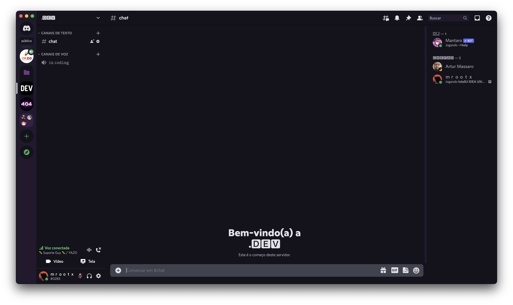

<h1 align="center">
   
  
   
  Omni Owl for <a href="https://betterdiscord.net">BetterDiscord</a>
   
</h1>

  <strong>Dark theme for <a href="https://betterdiscord.net">BetterDiscord</a></strong>

  
  
  
  
  

## Install

All instructions can be found at [INSTALL.md](./INSTALL.md).

### :writing_hand: **Author**

|  |
| ---------------------------------------------------------------------------------------------------------- |
| [Gabriel Maia](https://github.com/gabrielmaialva33)                                                        |

## License

[MIT License](./LICENSE)
